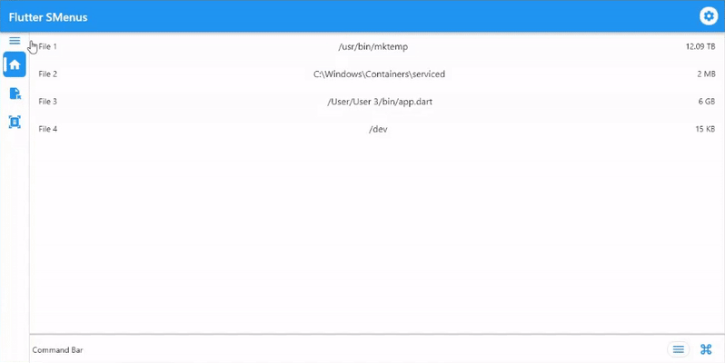

# Flutter SMenus

A Flutter package for dropdown menus, many types of side menus, three dot menus, and popup menus.
Almost any kind of menu can be created with this package with almost any style. The basic types of menu and their customizability is shown below. This package is super easy to use and includes the ability to customize the menus to the your imagination. All menus support custom menu pages or custom menu items. There are animated resizable menus, dropdown menus, and traditional menus.
<!--
This README describes the package. If you publish this package to pub.dev,
this README's contents appear on the landing page for your package.
For information about how to write a good package README, see the guide for
[writing package pages](https://dart.dev/guides/libraries/writing-package-pages).
For general information about developing packages, see the Dart guide for
[creating packages](https://dart.dev/guides/libraries/create-library-packages)
and the Flutter guide for
[developing packages and plugins](https://flutter.dev/developing-packages).
-->


# Features

See Showcase for visual on all types of menus and examples I've created.
  
## Menus

| Name                 | Description                                                                                        |
|----------------------|----------------------------------------------------------------------------------------------------|
| SResiableMenu        | A menu that can be resized programatically or phsyically                                           |
| SSlideMenu           | A menu that either slides in, slides in while body slides away, or body slides away to reveal menu |
| SDropdownMenuCascade | Classic dropdown menu                                                                              |
| SDropdownMenuMorph   | Dropdown popup menu using Hero                                                                     |


# Getting started

## Install

Visit the Install tab for more information

Add this line to your pubspec.yaml

```yaml
dependencies:
    flutter_smenus: ^1.0.0
```

or run this in your project's terminal

```shell
$ flutter pub add flutter_smenus
```

> Remember to run ```flutter pub get```


## Import

```dart
import 'package:flutter_smenus/flutter_smenus.dart'
```

## Use
Once you have done all of the above, you are ready to use this package!

Have a look below to see how to implement the custom menus.
# Showcase
## Simple App Using All Menus


Showcases coming soon:
```markdown
## Regular Menu
### Resizable Menu
#### Normal
#### No Bar
### Slide Menu
#### Normal
#### Only Menu
#### Only Body
## Dropdown Menu
### Cascade
### Morph
```

# Code


## SResizableMenu

```dart
SResizableMenu(
    controller: SMenuController(),
    position: SMenuPosition.left,
    items: [],
    body: Container(),
)
```

<details>
<summary>Parameters</summary>

Either ```items``` or ```builder``` must not be null

| Parameter            | Object Type                            | Default                           | Description                                                                                             |
|----------------------|----------------------------------------|-----------------------------------|---------------------------------------------------------------------------------------------------------|
| ```style```          | SMenuStyle?                            | SMenuStyle()                      | Color, border radius, size, padding, alignment. See ```SMenuStyle```                                    |
| ```controller```     | SMenuController?                       | SMenuController()                 | Controller to open, close, or toggle menu                                                               |
| ```items```          | List< SMenuItem>?                      | null                              | List of ```SMenuItem``` types that make the menu                                                        |
| ```builder```        | Widget Function(BuildContext context)? | null                              | Builder function for custom menu                                                                        |
| ```body```           | Widget?                                | Container()                       | The widget which contains the contents, or page                                                         |
| ```header```         | Widget?                                | null                              | The widget at the top of the menu                                                                       |
| ```footer```         | Widget?                                | null                              | The widget at the bottom of the menu                                                                    |
| ```scrollPhysics```  | ScrollPhysics?                         | null                              | How the menu should scroll                                                                              |
| ```direction```      | Axis?                                  | Axis.vertical                     | Scroll direction, this is set automatically. Do not change this unless you know what you are doing.     |
| ```duration```       | Duration?                              | const Duration(milliseconds: 250) | The duration for the animation of openning and closing the menu                                         |
| ```position```       | SMenuPosition?                         | SMenuPosition.left                | Which side of the screen the menu will be location                                                      |
| ```enableSelector``` | bool?                                  | false                             | In the event your menu items are menu buttons, turn on this selector to show the current selected item. |
| ```resizable```      | bool?                                  | true                              | If resizing bar should show                                                                             |
| ```barColor```       | Color?                                 | null                              | Color of resizing bar                                                                                   |
| ```barHoverColor```  | Color?                                 | null                              | Color of resizing bar when hovered                                                                      |
| ```barSize```        | double?                                | 3                                 | Size of resizing bar                                                                                    |
| ```barHoverSize```   | double?                                | 5                                 | Size of resizing bar when hovered                                                                       |


</details>


## SResizableMenuNoWrapper

```dart
Row(
    children: [
        SResizableMenuNoWrapper(
            controller: SMenuController(),
            position: SMenuPosition.left,
            items: [],
        ),
        Expanded(child: Container()),
    ],
)
```


<details>
<summary>Parameters</summary>

Either ```items``` or ```builder``` must not be null

| Parameter            | Object Type                            | Default                           | Description                                                                                             |
|----------------------|----------------------------------------|-----------------------------------|---------------------------------------------------------------------------------------------------------|
| ```style```          | SMenuStyle?                            | SMenuStyle()                      | Color, border radius, size, padding, alignment. See ```SMenuStyle```                                    |
| ```controller```     | SMenuController?                       | SMenuController()                 | Controller to open, close, or toggle menu                                                               |
| ```items```          | List< SMenuItem>?                      | null                              | List of ```SMenuItem``` types that make the menu                                                        |
| ```builder```        | Widget Function(BuildContext context)? | null                              | Builder function for custom menu                                                                        |
| ```header```         | Widget?                                | null                              | The widget at the top of the menu                                                                       |
| ```footer```         | Widget?                                | null                              | The widget at the bottom of the menu                                                                    |
| ```scrollPhysics```  | ScrollPhysics?                         | null                              | How the menu should scroll                                                                              |
| ```direction```      | Axis?                                  | Axis.vertical                     | Scroll direction, this is set automatically. Do not change this unless you know what you are doing.     |
| ```duration```       | Duration?                              | const Duration(milliseconds: 250) | The duration for the animation of openning and closing the menu                                         |
| ```position```       | SMenuPosition?                         | SMenuPosition.left                | Which side of the screen the menu will be location                                                      |
| ```enableSelector``` | bool?                                  | false                             | In the event your menu items are menu buttons, turn on this selector to show the current selected item. |
| ```resizable```      | bool?                                  | true                              | If resizing bar should show                                                                             |
| ```barColor```       | Color?                                 | null                              | Color of resizing bar                                                                                   |
| ```barHoverColor```  | Color?                                 | null                              | Color of resizing bar when hovered                                                                      |
| ```barSize```        | double?                                | 3                                 | Size of resizing bar                                                                                    |
| ```barHoverSize```   | double?                                | 5                                 | Size of resizing bar when hovered                                                                       |


</details>


## SSlideMenu

```dart
SSlideMenu(
    controller: SMenuController(),
    position: SMenuPosition.left,
    items: [],
    isBodyMovable = false,
    body: Container(),
)
```

<details>
<summary>Parameters</summary>

Either ```items``` or ```builder``` must not be null

| Parameter            | Object Type                            | Default                           | Description                                                                                             |
|----------------------|----------------------------------------|-----------------------------------|---------------------------------------------------------------------------------------------------------|
| ```style```          | SMenuStyle?                            | SMenuStyle()                      | Color, border radius, size, padding, alignment. See ```SMenuStyle```                                    |
| ```controller```     | SMenuController?                       | SMenuController()                 | Controller to open, close, or toggle menu                                                               |
| ```items```          | List< SMenuItem>?                      | null                              | List of ```SMenuItem``` types that make the menu                                                        |
| ```builder```        | Widget Function(BuildContext context)? | null                              | Builder function for custom menu                                                                        |
| ```body```           | Widget?                                | Container()                       | The widget which contains the contents, or page                                                         |
| ```header```         | Widget?                                | null                              | The widget at the top of the menu                                                                       |
| ```footer```         | Widget?                                | null                              | The widget at the bottom of the menu                                                                    |
| ```scrollPhysics```  | ScrollPhysics?                         | null                              | How the menu should scroll                                                                              |
| ```direction```      | Axis?                                  | Axis.vertical                     | Scroll direction, this is set automatically. Do not change this unless you know what you are doing.     |
| ```duration```       | Duration?                              | const Duration(milliseconds: 250) | The duration for the animation of openning and closing the menu                                         |
| ```position```       | SMenuPosition?                         | SMenuPosition.left                | Which side of the screen the menu will be location                                                      |
| ```enableSelector``` | bool?                                  | false                             | In the event your menu items are menu buttons, turn on this selector to show the current selected item. |
| ```barrierColor```   | Color?                                 | true                              | When menu is open, this is the color overlayed on the body                                              |
| ```enableGestures``` | bool?                                  | null                              | If gestures can open, close, or toggle the menu [WIP]                                                         |
| ```isBodyMovable```  | bool?                                  | true                              | Whether the body moves in the animation or not                                                          |
| ```isMenuMovable```  | bool?                                  | true                              | Whether the menu moves in the animation or not                                                          |


</details>


## SDropdownMenuCascade

```dart
SDropdownMenuCascade(
    controller: SMenuController(),
    items: [],
    child: Container(),
)
```

<details>
<summary>Parameters</summary>

| Parameter          | Object Type                         | Default                           | Description                                                                                            |
|--------------------|-------------------------------------|-----------------------------------|--------------------------------------------------------------------------------------------------------|
| ```items```        | List< SMenuItem< T>>                | required                          | List of ```SMenuItem``` types, with a value, that make the menu                                        |
| ```style```        | SDropdownMenuStyle?                 | SDropdownMenuStyle()              | Color, border radius, size, padding, alignment. See ```SDropdownMenuStyle```                           |
| ```controller```   | SMenuController?                    | SMenuController()                 | Controller to open, close, or toggle menu                                                              |
| ```header```       | Widget?                             | null                              | The widget at the top of the menu                                                                      |
| ```footer```       | Widget?                             | null                              | The widget at the bottom of the menu                                                                   |
| ```hideIcon```     | bool?                               | false                             | If icon should be hidden                                                                               |
| ```duration```     | Duration?                           | const Duration(milliseconds: 250) | The duration for the animation of openning and closing the menu                                        |
| ```child```        | Widget?                             | null                              | Initial widget to display as the dropdown menu button                                                  |
| ```icon```         | Widget?                             | null                              | Icon to display next to the child                                                                      |
| ```leadingIcon```  | bool?                               | false                             | If Icon should come before text                                                                        |
| ```onChange```     | void Function(T value, int index)?? | null                              | Function to call when the currently picked value of the dropdown is changed                            |
| ```showSelected``` | bool?                               | true                              | If selected widget should be displayed when menu is closed                                             |
| ```isSmall```      | bool?                               | false                             | Whether only the icon is shown or not                                                                  |
| ```buttonStyle```  | SMenuItemStyle?                     | SMenuItemStyle()                  | The style of each item of the dropdown                                                                 |
| ```barrierColor``` | Color?                              | Colors.black26                    | The color of the overlay that is underneath the expanded menu, covering all other things on the screen |

</details>

## SDropdownMenuMorph

```dart
SDropdownMenuMorph(
    controller: SMenuController(),
    items: [],
    child: Container(),
)
```

<details>
<summary>Parameters</summary>

| Parameter          | Object Type                         | Default              | Description                                                                  |
|--------------------|-------------------------------------|----------------------|------------------------------------------------------------------------------|
| ```items```        | List< SMenuItem< T>>                | required             | List of ```SMenuItem``` types, with a value, that make the menu              |
| ```style```        | SDropdownMenuStyle?                 | SDropdownMenuStyle() | Color, border radius, size, padding, alignment. See ```SDropdownMenuStyle``` |
| ```controller```   | SMenuController?                    | SMenuController()    | Controller to open, close, or toggle menu                                    |
| ```header```       | Widget?                             | null                 | The widget at the top of the menu                                            |
| ```footer```       | Widget?                             | null                 | The widget at the bottom of the menu                                         |
| ```hideIcon```     | bool?                               | false                | If icon should be hidden                                                     |
| ```child```        | Widget?                             | null                 | Initial widget to display as the dropdown menu button                        |
| ```icon```         | Widget?                             | null                 | Icon to display next to the child                                            |
| ```leadingIcon```  | bool?                               | false                | If Icon should come before text                                              |
| ```onChange```     | void Function(T value, int index)?? | null                 | Function to call when the currently picked value of the dropdown is changed  |
| ```showSelected``` | bool?                               | true                 | If selected widget should be displayed when menu is closed                   |
| ```isSmall```      | bool?                               | false                | Whether only the icon is shown or not                                        |
| ```itemStyle```    | SMenuItemStyle?                     | SMenuItemStyle()     | The style of each item of the dropdown                                       |

</details>


## SMenuItemButton

```dart
SMenuItemButton(
    icon: Icons.home,
    value: 1,
    title: Text('Home'),
    isSelected: select,
    onPressed: () {
        setState((){
            select = !select;
        });
    }
)
```

<details>
<summary>Parameters</summary>

| Parameter               | Object Type      | Default          | Description                                                                                    |
|-------------------------|------------------|------------------|------------------------------------------------------------------------------------------------|
| ```icon```              | IconData         | required         | The icon shown on this button                                                                  |
| ```style```             | SMenuItemStyle?  | SMenuItemStyle() | Color, border radius, size, padding, alignment. See ```SMenuItemStyle```                       |
| ```value```             | T?               | null             | Value of this item, could be ```string```, ```int```, ```double```, etc.                       |
| ```title```             | Widget?          | null             | The widget that represents the title or text that is displayed on this button next to the icon |
| ```selectedTextColor``` | Color?           | null             | The color of text when the button is selected                                                  |
| ```selectedIconColor``` | Color?           | null             | The color of the icon when the button is selectedu                                             |
| ```textColor```         | Color?           | null             | The color of text when the button is not selected                                              |
| ```iconColor```         | Color?           | null             | The color of icon when the button is not selected                                              |
| ```isSelected```        | bool?            | false            | If this button is in selected mode, must be set in a setState to see change                    |
| ```onPressed```         | void Function()? | null             | Action when button is pressed                                                                  |


</details>


## SMenuItemCustom


```dart
SMenuItemCustom(
    value: 'Custom Item',
    builder: () {
        return Text('Menu Item');
    }
)
```


<details>
<summary>Parameters</summary>

| Parameter     | Object Type                                                                  | Default          | Description                                                                                                                                                                                                    |
|---------------|------------------------------------------------------------------------------|------------------|----------------------------------------------------------------------------------------------------------------------------------------------------------------------------------------------------------------|
| ```child```   | Widget?                                                                      | Container()      | The widget that makes up the menu item                                                                                                                                                                         |
| ```style```   | SMenuItemStyle?                                                              | SMenuItemStyle() | Color, border radius, size, padding, alignment. See ```SMenuItemStyle```                                                                                                                                       |
| ```value```   | T?                                                                           | null             | Value of this item, could be ```string```, ```int```, ```double```, etc.                                                                                                                                       |
| ```builder``` | Widget Function(BuildContext context, SMenuItemStyle? style, Widget? child)? | null             | If builder is not null, then the builder function will be used to make the menu item rather than the child. A builder function has parameters context, style, and child. This function should return a widget. |


</details>


## SMenuItemDropdown

```dart
SMenuItemDropdown(
    value: 1,
    title: Text('Dropdown Item')
)
```

<details>
<summary>Parameters</summary>

| Parameter       | Object Type      | Default          | Description                                                              |
|-----------------|------------------|------------------|--------------------------------------------------------------------------|
| ```value```     | T                | required         | Value of this item, could be ```string```, ```int```, ```double```, etc. |
| ```leading```   | Widget?          | null             | The widget at the very left                                              |
| ```title```     | Widget?          | null             | The main widget                                                          |
| ```trailing```  | Widget?          | null             | The widget at the very right                                             |
| ```style```     | SMenuItemStyle?  | SMenuItemStyle() | Color, border radius, size, padding, alignment. See ```SMenuItemStyle``` |
| ```onPressed``` | void Function()? | null             | Called when this item is pressed                                         |


</details>


## SMenuItemDropdownSelectable

ListTile version of ```SMenuItemDropdown```
```dart
SMenuItemDropdownSelectable(
    value: 1,
    title: Text('Dropdown Item')
)
```

<details>
<summary>Parameters</summary>

| Parameter       | Object Type      | Default  | Description                                                              |
|-----------------|------------------|----------|--------------------------------------------------------------------------|
| ```value```     | T                | required | Value of this item, could be ```string```, ```int```, ```double```, etc. |
| ```leading```   | Widget?          | null     | The widget at the very left                                              |
| ```title```     | Widget?          | null     | The main widget                                                          |
| ```trailing```  | Widget?          | null     | The widget at the very right                                             |
| ```onPressed``` | void Function()? | null     | Called when this item is pressed                                         |


</details>


## SMenuStyle


```dart
SMenuStyle(
    borderRadius: BorderRadius.circular(15),
    size: BoxContraints(minWidth: 50, maxWidth: 250)
)
```

<details>
<summary>Parameters</summary>

| Parameter             | Object Type        | Default | Description                                                                                                                                                                                                                    |
|-----------------------|--------------------|---------|--------------------------------------------------------------------------------------------------------------------------------------------------------------------------------------------------------------------------------|
| ```borderRadius```    | BorderRadius?      | null    | The amount and style of the border radius around the menu                                                                                                                                                                      |
| ```headerAlignment``` | MainAxisAlignment? | null    | NI                                                                                                                                                                                                                             |
| ```padding```         | EdgeInsets?        | null    | The padding around the menu                                                                                                                                                                                                    |
| ```size```            | BoxConstraints?    | null    | The size of the menu. For top or bottom positioned menu, use minHeight and maxHeight to set closed and open sizes respectively. For left or right positions, use minWidth and maxWidth for closed and open sizes respectively. |
| ```border```          | BoxBorder?    | null    | The border to apply around the menu.                                                                                                                                                                                           |
| ```footerAlignment``` | MainAxisAlignment? | null    | NI                                                                                                                                                                                                                             |
| ```alignment```       | MainAxisAlignment? | null    | NI                                                                                                                                                                                                                             |
| ```barColor```        | Color?             | null    | NI                                                                                                                                                                                                                             |
| ```backgroundColor``` | Color?             | null    | Color of the background of the men                                                                                                                                                                                             |


</details>


## SDropdownMenuStyle

```dart
SDropdownMenuStyle(
    borderRadius: BorderRadius.circular(15),
)
```

<details>
<summary>Parameters</summary>

| Parameter          | Object Type             | Default                             | Description                                                                    |
|--------------------|-------------------------|-------------------------------------|--------------------------------------------------------------------------------|
| ```alignment```    | SDropdownMenuAlignment? | SDropdownMenuAlignment.bottomCenter | Which way the dropdown should open and be positioned                           |
| ```constraints```  | BoxConstraints?         | null                                | The constraints on the size of the dropdown menu                               |
| ```offset```       | Offset?                 | null                                | The offset to apply when determining the opening position of the dropdown menu |
| ```width```        | double                  | 250                                 | (required) The width of the menu                                               |
| ```height```       | double?                 | null                                | The height of the menu                                                         |
| ```elevation```    | double?                 | null                                | The elavation to apply to the menu background                                  |
| ```color```        | Color?                  | null                                | The color of the menu background                                               |
| ```padding```      | EdgeInsets?             | null                                | The padding around the menu                                                    |
| ```borderRadius``` | BorderRadius?           | null                                | The amount and shape of border radius to apply to the menu                     |


</details>


## SMenuItemStyle

```dart
SMenuItemStyle(
    borderRadius: BorderRadius.circular(15),
)
```

<details>
<summary>Parameters</summary>

| Parameter                 | Object Type        | Default | Description                                                                              |
|---------------------------|--------------------|---------|------------------------------------------------------------------------------------------|
| ```mainAxisAlignment```   | MainAxisAlignment? | null    | NI                                                                                       |
| ```borderRadius```        | BorderRadius?      | null    | The amount and shape of border radius to apply to the menu                               |
| ```shape```               | OutlinedBorder?    | null    | The shape of the widget that makes up the item                                           |
| ```elevation```           | double?            | null    | The elavation to apply to the item                                                       |
| ```padding```             | EdgeInsets?        | null    | The padding around the menu item                                                         |
| ```constraints```         | BoxConstraints?    | null    | The constraints on the size of the item                                                  |
| ```width```               | double             | null    | The width of the menu item                                                               |
| ```height```              | double?            | null    | The height of the menu item                                                              |
| ```accentColor```         | Color?             | null    | The accent, or primary, color of the item. This is applied to things like icons and text |
| ```selectedAccentColor``` | Color?             | null    | The accent color when the item is selected                                               |
| ```bgColor```             | Color?             | null    | The background color                                                                     |
| ```selectedBgColor```     | Color?             | null    | The background color when the item is selected                                           |


</details>


## SMenuPosition

```dart
SMenuPosition.top
SMenuPosition.bottom
SMenuPosition.left
SMenuPosition.right
SMenuPosition.isVertical
SMenuPosition.isHorizontal
```

<details>
<summary>More Information</summary>

| Value                            | Value Type | Description                                        |
|----------------------------------|------------|----------------------------------------------------|
| ```SMenuPosition.top```          | Enum       | Position the menu at the top of a screen           |
| ```SMenuPosition.bottom```       | Enum       | Position the menu at the bottom of a screen        |
| ```SMenuPosition.left```         | Enum       | Position the menu to the left of a screen          |
| ```SMenuPosition.right```        | Enum       | Position the menu to the right of a screen         |
| ```SMenuPosition.isVertical```   | bool       | True if position is currently set to top or bottom |
| ```SMenuPosition.isHorizontal``` | bool       | True if position is currently set to left or right |


</details>


## SDropdownMenuAlignment

```dart
SDropdownMenuAlignment.topLeft
SDropdownMenuAlignment.topCenter
SDropdownMenuAlignment.topRight
SDropdownMenuAlignment.centerLeft
SDropdownMenuAlignment.center
SDropdownMenuAlignment.centerRight
SDropdownMenuAlignment.bottomLeft
SDropdownMenuAlignment.bottomCenter
SDropdownMenuAlignment.bottomRight
```

<details>
<summary>More Information</summary>

Dropdown button is located at the center. The dropdown will open in these directions as specificed by the alignment:

|             |               |              |
|-------------|---------------|--------------|
| Top Left    | Top Center    | Top Right    |
| Center Left | Center        | Center Right |
| Bottom Left | Bottom Center | Bottom RIght |

</details>


## SMenuController

```dart
SMenuController.open()
SMenuController.close()
SMenuController.toggle()
SMenuController.state
    -> SMenuController.state.addListenter()
    -> SMenuController.state.removeListenter()
    -> SMenuController.state.value = <SMenuState>
    -> ... other ValueNotifier methods
```

<details>
<summary>More Information</summary>


| Name                           | Type                       | Description                                                                                                                  |
|--------------------------------|----------------------------|------------------------------------------------------------------------------------------------------------------------------|
| ```SMenuController.open()```   | Method                     | Open the menu that this controller is assigned to                                                                            |
| ```SMenuController.close()```  | Method                     | Close the menu that this controller is assigned to                                                                           |
| ```SMenuController.toggle()``` | Method                     | Toggle the menu that this controller is assigned to                                                                          |
| ```SMenuController.state```    | ValueNotifier< SMenuState> | A value notifier that will send an update when the state of the menu changes. The value of this notifier is ```SMenuState``` |

</details>


## SMenuState

```dart
SMenuState.open
SMenuState.closed
SMenuState.opening
SMenuState.closing
```

<details>
<summary>More Information</summary>


| Value                    | Description                                                                              |
|--------------------------|------------------------------------------------------------------------------------------|
| ```SMenuState.open```    | The menu is currently not fully closed                                                   |
| ```SMenuState.closed```  | The menu is currently fully closed                                                       |
| ```SMenuState.opening``` | The menu is currently in the process of opening. The animation to open is still playing  |
| ```SMenuState.closing``` | The menu is currently in the process of closing. The animation to close is still playing |

</details>


# Additional information

### More: 
#### Additional Classes

| Class                    | Object Type                          |
|--------------------------|--------------------------------------|
| ```FadePageRoute```      | PageRoute< T>                        |
| ```SlidePageRoute```     | PageRoute< T>                        |
| ```SlideDirection```     | Enum                                 |
| ```SBaseMenu```          | Abstract Stateful Widget Class       |
| ```SBaseMenuState```     | Abstract Stateful Widget State Class |
| ```SDropdownMenu```      | Abstract Stateful Widget Class       |
| ```SDropdownMenuState``` | Abstract Stateful Widget State Class |


### Contribute: -

### Issues: -


> Note: Some features may not work with custom children, this includes but is not limited to dropdown menus having nuances with values, having picked item displayed, or even the inkwell to display clicking. These work fine with ```SMenuItem```, but custom items may have issues. Use at your own risk.